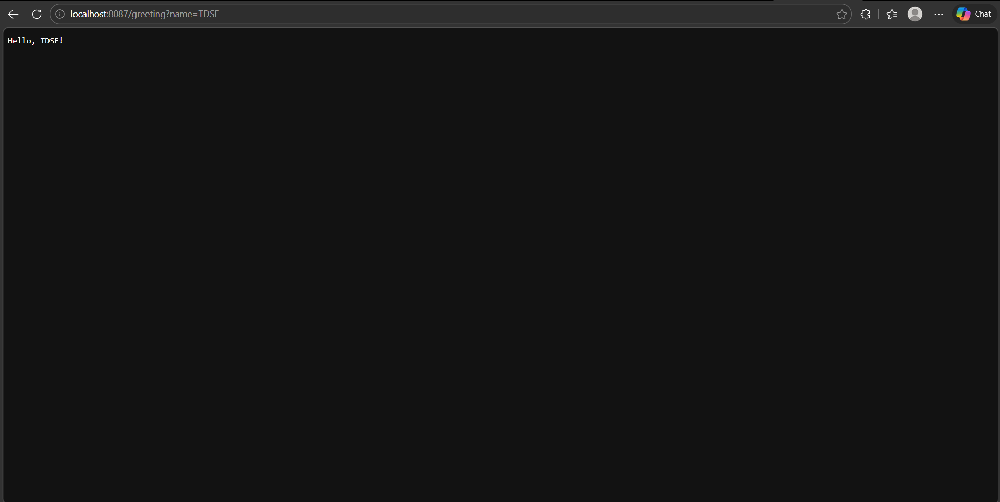
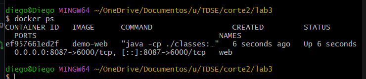
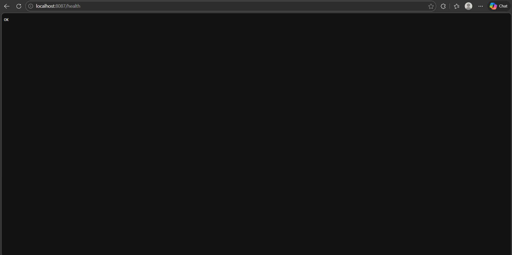
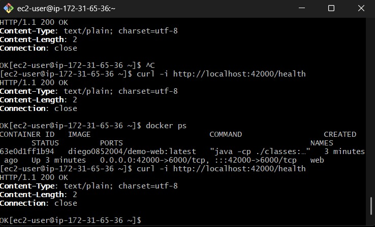
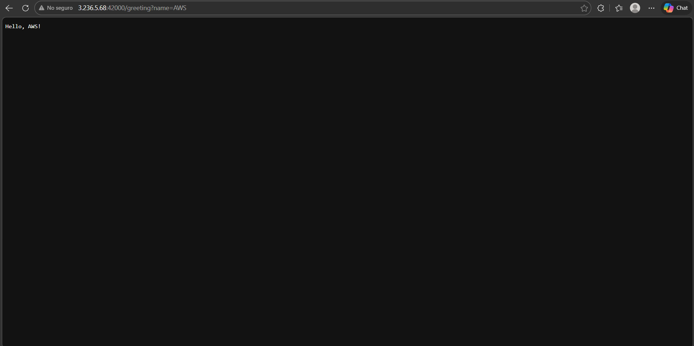
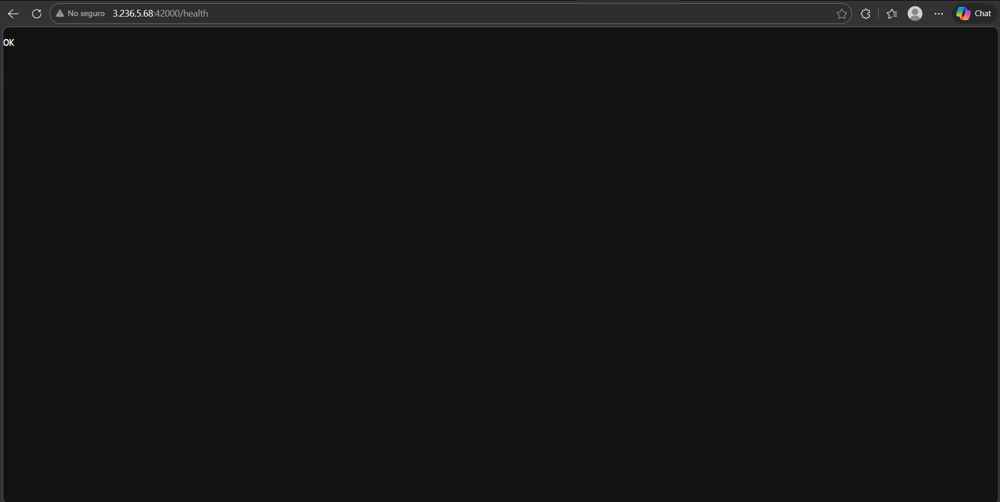
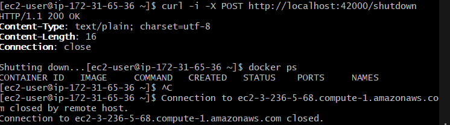
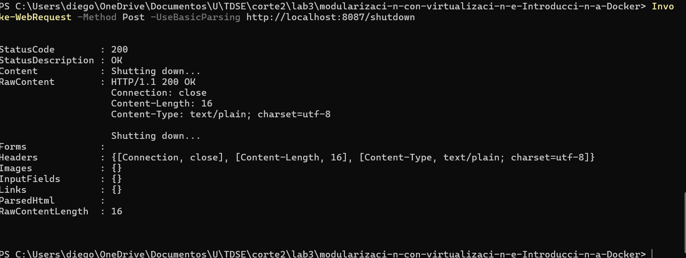

# Modularization with Virtualization & Introduction to Docker (Lab)
This project is a **Java HTTP server built with a custom framework (no Spring)**, containerized with **Docker**, published to **Docker Hub**, and deployed on **AWS EC2**. The server is **concurrent** (Thread Pool using `ExecutorService`) and supports **graceful shutdown** via `POST /shutdown` and a shutdown hook.

---

## Getting Started
These instructions will help you run the project locally for development/testing and deploy it using Docker and AWS EC2.

---

## Prerequisites
Install the following:

- **Java 17+**
- **Maven 3.x**
- **Docker Desktop**
- **Docker Hub account** (to push the image)
- **AWS EC2 instance** + SSH access

### Verify installations
```bash
java -version
mvn -version
docker --version
```

---

## Installing
### 1) Build the project with Maven
From the project root:

```bash
mvn clean package
```

> Windows note: if your `Dockerfile` expects `target/dependency` and it does not exist, create it before building:
```powershell
New-Item -ItemType Directory -Force .\target\dependency | Out-Null
```

### 2) Run locally without Docker (optional)
Run the server specifying the port via environment variable.

**Windows PowerShell**
```powershell
$env:PORT=6000
java -cp "target\classes;target\dependency\*" com.example.demo.app.Main
```

**Linux/Mac**
```bash
PORT=6000 java -cp "target/classes:target/dependency/*" com.example.demo.app.Main
```

Test:
- `http://localhost:6000/health`
- `http://localhost:6000/greeting?name=Diego`

---

## Running the tests
This lab project does not include automated tests.

Minimal functional checks:

```bash
curl -i http://localhost:6000/health
curl -i "http://localhost:6000/greeting?name=Test"
```

---

## Deployment
### A) Docker (Local)
#### 1) Build the Docker image
From the project root (where the `Dockerfile` is located):

```bash
docker build -t demo-web .
```

#### 2) Run the container
Map host port **8087** to container port **6000**:

```bash
docker rm -f web 2>/dev/null || true
docker run -d --name web -p 8087:6000 -e PORT=6000 demo-web
docker ps
```

Test:
- `http://localhost:8087/health`
- `http://localhost:8087/greeting?name=Local`
- 

#### 3) Graceful shutdown (local)
```bash
curl -i -X POST http://localhost:8087/shutdown
```

---

### B) Docker Compose (Optional)
If you have a `docker-compose.yml` with services (e.g., `web` and a MongoDB `db`), run:

```bash
docker compose up -d --build
docker compose ps
```

Test:
- `http://localhost:8087/health`

---

### C) Push to Docker Hub
Login:
```bash
docker login
```

Tag:
```bash
docker tag demo-web diego0852004/demo-web:latest
```

Push:
```bash
docker push diego0852004/demo-web:latest
```

---

### D) AWS EC2 Deployment
#### 1) Install Docker on EC2 (Amazon Linux)
Inside the EC2 instance:

```bash
sudo yum update -y
sudo yum install docker -y
sudo service docker start
sudo usermod -a -G docker ec2-user
exit
```

Reconnect via SSH (required to apply the `docker` group).

#### 2) Pull and run the container from Docker Hub
```bash
docker pull diego0852004/demo-web:latest
docker rm -f web 2>/dev/null || true
docker run -d --name web -p 42000:6000 -e PORT=6000 diego0852004/demo-web:latest
docker ps
```

Test inside EC2:
```bash
curl -i http://localhost:42000/health
curl -i "http://localhost:42000/greeting?name=EC2"
```

#### 3) Security Group (Inbound rules)
Open the following ports:
- **SSH**: TCP 22 (preferably only your public IP)
- **App port**: Custom TCP **42000** from `0.0.0.0/0` (for lab/testing)

#### 4) Test from your computer
Replace `<EC2_PUBLIC_IP>` with your instance public IP:

- `http://<EC2_PUBLIC_IP>:42000/health`
- `http://<EC2_PUBLIC_IP>:42000/greeting?name=AWS`

#### 5) Graceful shutdown (EC2)
From EC2:
```bash
curl -i -X POST http://localhost:42000/shutdown
```

Or from your computer:
```bash
curl -i -X POST http://<EC2_PUBLIC_IP>:42000/shutdown
```

---

## Architecture
- **Main**: registers routes and starts the server.
- **HttpServer**: accepts TCP connections using `ServerSocket` and dispatches requests using a **Thread Pool** (`ExecutorService`) for concurrency.
- **Router**: maps (HTTP method + path) to handlers.
- **Request / Response**: basic HTTP parsing and response building.
- **Controllers/Handlers**: endpoint implementations.

### Endpoints
- `GET /health` → `OK`
- `GET /greeting?name=World` → personalized greeting
- `POST /shutdown` → graceful shutdown

---

## Built With
- **Java 17+**
- **Maven**
- **Docker / Docker Compose**
- **AWS EC2**

---

## Contributing
Academic lab project. No contribution process defined.

---

## Versioning
Docker Hub is published using the `latest` tag for this lab.

---

## Authors
- Diego Rozo

---

## License
Educational use.

---

## Acknowledgments
- TDSE Lab: modularization, Docker, and AWS EC2 deployment.

---







- gracefull shutdowm


**Video**: https://youtu.be/Nxt95IwTMug